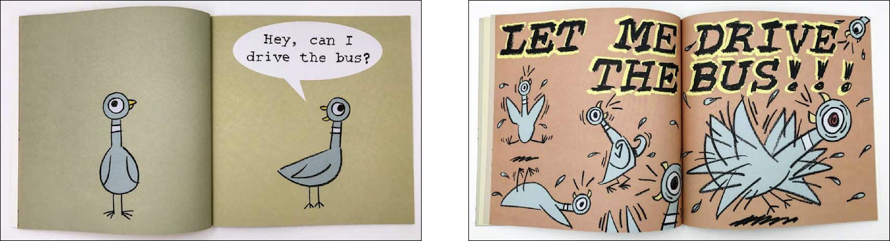

<!--jump to anchor tag adjusted to header height offset-->

# What Is Interactive Animation?

---

## Animation

> "Animation is a filmmaking technique whereby still images are manipulated to create moving images."
> 
> -- Wikipedia, "[Animation](https://en.wikipedia.org/wiki/Animation)"

 

On a technical level, animation is the result of playing still frames at a certain speed (ie. frame rate), which results in a moving image.

Take the classic bouncing ball, for example--

 

> **animation:**  (noun) The act, process, or result of **imparting life, interest, spirit, motion, or activity**; The quality or condition of being alive, active, spirited, or vigorous.
> 
> -- The American Heritage Dictionary of the English Language, 5th Edition.

 

Animation is also about **the illusion of life**, or the **"believability"** of the moving image. To achieve this, animators play the role of an actor who performs through the images they create.

 

<figure>
    
    <figcaption>-- Richard Williams, "The Animator's Survival Kit", p. 9.</figcaption>
</figure>

 

<figure>
    
    <figcaption>-- Walk cycle reference, taken from "The Animator's Survival Kit". Notice the "bouncing ball" in this example?</figcaption>
</figure>

 

From reference to performance. 

<figure>
    
    <figcaption>-- Masaaki Yuasa, "Happy Machine" from animated film antholog Genius Party (2007).In this example (and many of Yuasa's other walk cycle animations), he tends to emphasise the lifting of the heel as the back leg moves forward, and the lifting of the toes as the front leg steps onto the ground.</figcaption>
</figure>

 

<!--mason lindroth example-->
<figure>
     
    
    <figcaption>-- Mason Lindroth, Character animations for Hylics using video footage composited with 3D models in Blender.</figcaption>
</figure>

 

---

## Interactivity

**The agency and control to mutually act upon each other**

> - <figure>
"(of two or more persons, forces, etc) acting upon or in close relation with each other" 
<figcaption>-- Collins English Dictionary</figcaption></figure>
> 
> - <figure>
"a measure of a media's potential ability to let the user exert an influence on the content and/or form of the mediated communication."
<figcaption>-- Jens Jensen and Cathy Toscan, "Interactive Television: TV of the Future or Future of the TV?" (1999)</figcaption></figure>

 

**Two-way communication**

> - <figure>
"a form of information exchange between different actors (between groups of people, or between humans and machines)"
<figcaption>-- Peter Mechant and Jan Van Looy, "Interactivity" (2014)</figcaption></figure>
> 
> - <figure>
"cyclical process in which two actors alternately listen, think and speak."
<figcaption>-- Chris Crawford, "Understanding Interactivity (2002)"</figcaption></figure>

 

---

## Interactive Animation

In this class, our practice of interactive animation is concerned with the creation of 2D and 3D assets for video game engines, specificially focusing on Unity and its animation systems.

That being said, animation and games share a similar history that's rooted in performance-based practices such as puppetry, shadow and projection-based theater, as well as role-playing.

 

**Kinetic objects activated by animator-actor-performer**

<figure>
    

        

        
        

        

        
        

    

    <figcaption>-- Statuette of an Egyptian painter, 2000 ~ 1000 BC (left); 5200 year-old Iranian earthenware bowl at the Burnt City in Iran (right)</figcaption>
</figure>

 

<figure>
    
    
    <figcaption>-- Thaumatrope (1824) – invented by John Ayrton Paris</figcaption>
</figure>

 

<figure>
    
    <figcaption>-- Zoetrope (“1830”) – though actually invented in China, attributed to Ding Huan, 180 CE.</figcaption>
</figure>

 

<figure>
     
    
    <figcaption>-- Phenakistoscope (1833) – spin the disk and look at it, through the slits, reflected in a mirror.</figcaption>
</figure>

 

**Physical Props / Puppets for Projection Theatre**

<figure>
    
    <figcaption>-- 19th century Chinese shadow puppet (left); Contemporary shadow puppet troupe led by Khun Charon, Thailand (right)</figcaption>
</figure>

 

<figure>
    <iframe width="560" height="315" src="https://www.youtube-nocookie.com/embed/w1XkqtzLfKo?si=qcjlf_VnRJT4BD_C&amp;start=188" title="YouTube video player" frameborder="0" allow="accelerometer; autoplay; clipboard-write; encrypted-media; gyroscope; picture-in-picture; web-share" referrerpolicy="strict-origin-when-cross-origin" allowfullscreen></iframe> 
    
    <figcaption>-- The Magic Lantern, invented by Christiaan Huygens (1662)</figcaption>
</figure>

 

**Early Classical Animation as Cinematic Attraction**

<figure>
    <iframe width="560" height="315" src="https://www.youtube-nocookie.com/embed/aEAObel8yIE?si=TFnF5_vc94H2LF_b" title="YouTube video player" frameborder="0" allow="accelerometer; autoplay; clipboard-write; encrypted-media; gyroscope; picture-in-picture; web-share" referrerpolicy="strict-origin-when-cross-origin" allowfullscreen></iframe>
    <figcaption>-- Emile Cohl, "Fantasmagorie" (1908)</figcaption>
</figure>

 

<figure>
    <iframe width="560" height="315" src="https://www.youtube-nocookie.com/embed/32pzHWUTcPc?si=shXPzw20Rcrvi6pv" title="YouTube video player" frameborder="0" allow="accelerometer; autoplay; clipboard-write; encrypted-media; gyroscope; picture-in-picture; web-share" referrerpolicy="strict-origin-when-cross-origin" allowfullscreen></iframe>
    <figcaption>-- Windsor McCay, "Gertie the Dinosaur" (1914).</figcaption>
</figure>

 

<figure>
    <iframe width="560" height="315" src="https://www.youtube-nocookie.com/embed/cv1jE5kes6w?si=FaV4Ck0uH8NvHL0R" title="YouTube video player" frameborder="0" allow="accelerometer; autoplay; clipboard-write; encrypted-media; gyroscope; picture-in-picture; web-share" referrerpolicy="strict-origin-when-cross-origin" allowfullscreen></iframe>
    <figcaption>-- Max Fleischer, "The Clown's Pup" (1919) from his animated film series Out of the Inkwell.</figcaption>
</figure>

 

<figure>
    <blockquote>
Early animated films tended to downplay any sense that the animated world was “real.” Particularly in earlier examples, animation is very much part of the “cinema of attractions” as described by Tom Gunning. The novelty of the form was integral to the appeal of much early silent animation, and this is highlighted and exploited through a number of devices. Predictably, gags and situations that are impossible to perform in live action are a key element, and the process of animation itself was often foregrounded. Donald Crafton has noted that the interjection (literally or metaphorically) of the figure of the “life-giving” animator is a key theme of early animation, from Winsor McCay’s Gertie the Dinosaur (1914) to Max Fleischer’s “Out of the Inkwell” series. While the act of giving life is often shown as a magical rather than industrial process, such intervention nevertheless highlights that the animated world is not a closed, hermetic story world in the sense encouraged by classical Hollywood narratives. 

    </blockquote>
    <figcaption>-- Stephen Rowley, "Life Reproduced in Drawings: Realism in Animation" (2006)</figcaption>
</figure>

 

**CG puppetry**

<figure>
    <iframe width="560" height="315" src="https://www.youtube-nocookie.com/embed/dP6TUB7KQc4?si=vGblUcyYv0IIDR1D" title="YouTube video player" frameborder="0" allow="accelerometer; autoplay; clipboard-write; encrypted-media; gyroscope; picture-in-picture; web-share" referrerpolicy="strict-origin-when-cross-origin" allowfullscreen></iframe>
    <figcaption>
    -- Jim Henson and Steve Whitmire, Waldo C. Graphic (1989)
    </figcaption>
</figure>

 

<figure>
    <iframe width="560" height="315" src="https://www.youtube-nocookie.com/embed/D-UmfqFjpl0?si=kEa3nqdUUBPfm_k3" title="YouTube video player" frameborder="0" allow="accelerometer; autoplay; clipboard-write; encrypted-media; gyroscope; picture-in-picture; web-share" referrerpolicy="strict-origin-when-cross-origin" allowfullscreen></iframe> 
    
    <figcaption>
    -- Joe (YouTube), "Dog of Wisdom" (2015); the "life-giving" animator's hand using <a href="https://www.youtube.com/watch?v=0a_M9VsZ6Lk">the Leap Motion controller</a>.
    </figcaption>
</figure>

 

---

## In-class Activity

For 30 minutes, we'll do an activity to inspire interactive concepts that have the most minimal scope possible. Feel free to base our first tutorial exercise for Project 1 on an idea from this brainstorm activity...

### STEP 1

Pair into **groups of two or three**, and play with an interactive children's book. 

- Really though -- play with it. Give yourself to the book as wholeheartedly as you can. It will be a little embarrassing. Touch the book, talk to it.
- **Interact with as many of these books as you can.** If you’re not interested in the book you have, trade it.

 

### STEP 2

After you've had a chance to play with a book, consider writing notes on the following...

- Examine **your relationship with the “narrator”** in these books. Do you find yourself role-playing as someone else? What does it feel like to be told what to do by a book?
- Did any of these interactions bring about a **genuine feeling** in you? Surprise? Delight? Frustration?
- What combination of **design elements** made you experience the feeling?

Example 1: 

> "The cartoonish design of the treasure chest led me to believe there would be something fun inside. There *was* something fun under the flap—it was a monkey. This makes me feel satisfied."

 

Example 2:

>  "I am told that if I press a yellow dot, I can change its color to blue, but I know that the yellow dot will be blue on the next page whether I press it or not. This makes me feel nihilistic."

 

### STEP 3

Take inspiration from one of these simple book interactions, and **design a minimal scenario** based on that interaction and the feeling it gives you. 

Write down the scenario you came up with. 

Example: 

> **Example book interaction:**  Tell the pigeon he can't drive the bus
> 
>   
> **Example scenario:**  My sister says “please touch my hat!” I don’t touch it, and after 5 seconds she starts crying.