

<!--jump to anchor tag adjusted to header height offset-->

# Key Principles of Interactive Animation

## Animation Fundamentals

### The 12 Principles

Developed by two Disney animators in 1981 who were studying the values outlined by *other* Disney animators from the 1930's onwards. 

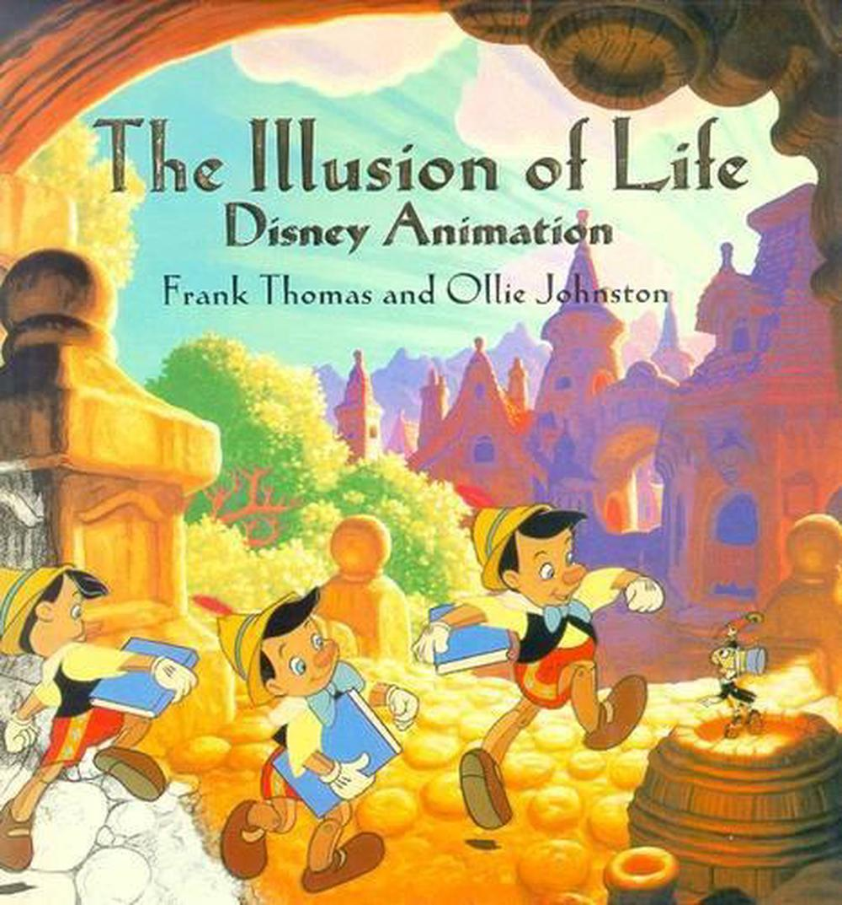

 

Given that these principles come from a very specific style of Disney animation, not all of these principles may be applicable to everyone. However, they are useful to consider as a general vocabulary for describing basic steps and thought processes behind animation practices.

 

#### 1. Squash and Stretch

The physical effects of pushing and pulling by gravity, velocity, and other forces acting upon a body. Describes the material and expressive quality of an animated object -- e.g. how elastic and heavy something is. 

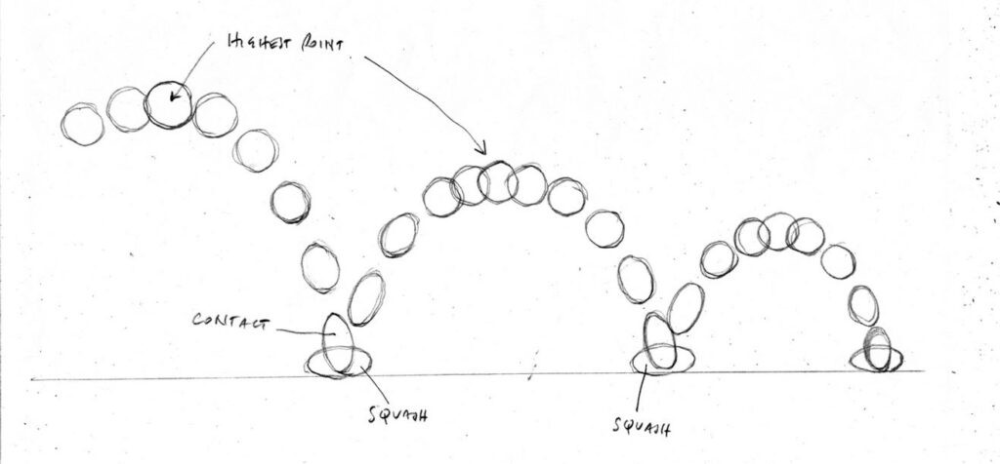

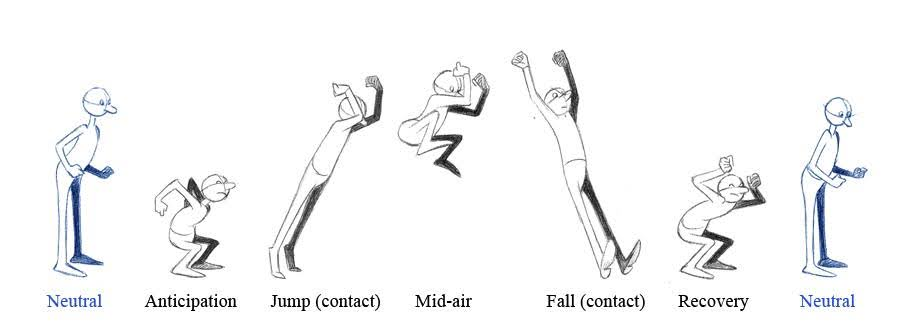

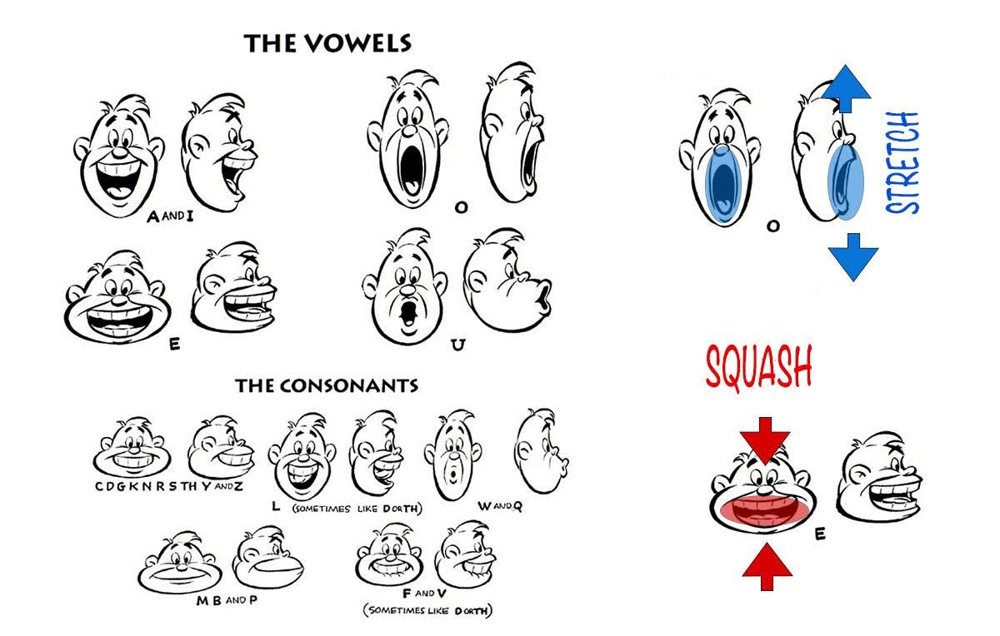

 

#### 2. Anticipation

Build-up momentum before release.

<iframe width="560" height="315" src="https://www.youtube-nocookie.com/embed/0sCSK1Ox5Ts?si=dWlZx9jRKFY-DB-m" title="YouTube video player" frameborder="0" allow="accelerometer; autoplay; clipboard-write; encrypted-media; gyroscope; picture-in-picture; web-share" referrerpolicy="strict-origin-when-cross-origin" allowfullscreen></iframe>

 

#### 3. Staging

How are you setting up your scene to tell a story? What should your audience be looking at or paying attention to?

Think about how to communicate **key actions and story beats**, as well as **direct your audience's gaze** using cinematography, composition and framing, background set, as well as timing.

<figure>
<iframe width="560" height="315" src="https://www.youtube-nocookie.com/embed/TJI_gygXsfs?si=f_J2-v9c-q2zy39b" title="YouTube video player" frameborder="0" allow="accelerometer; autoplay; clipboard-write; encrypted-media; gyroscope; picture-in-picture; web-share" referrerpolicy="strict-origin-when-cross-origin" allowfullscreen></iframe>
<figcaption>Looney Tunes, Rabbit of Seville. "Be Vewy Quiet, I'm Hunting Wabbits!"</figcaption>
</figure>

 

#### 4. Straight ahead VS Pose-to-pose

**Straight ahead** is most common for effects animation -- start with one drawing and draw the next until you're done. It's a spontaneous, fluid, and almost unconscious way of animating, because there's no predefined keyframes to act as your blueprint. 

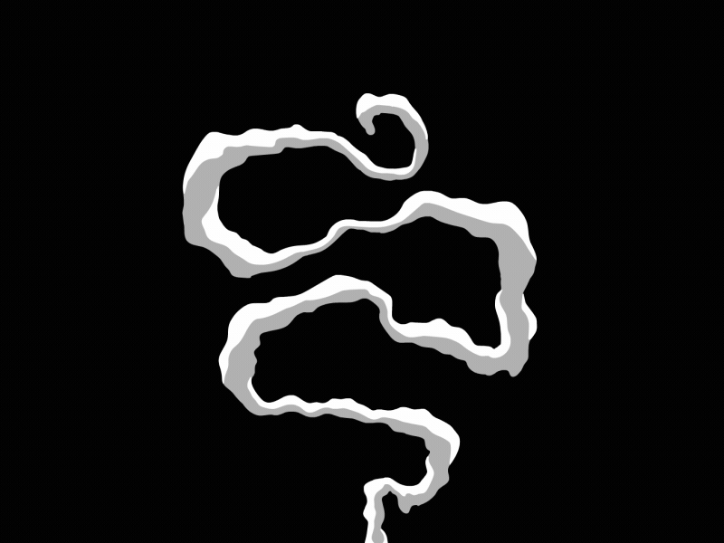

 

**Pose-to-pose** begins with the establishments of keyframes, followed by the filling in of empty gaps with in-betweens that. It's a very structured, calculated, and logical way of animating, giving clarity as to where our drawings will be at which time. 

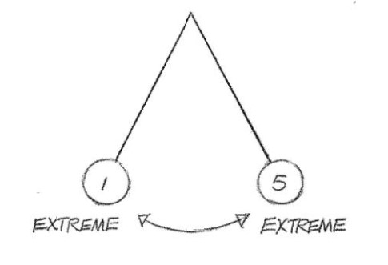

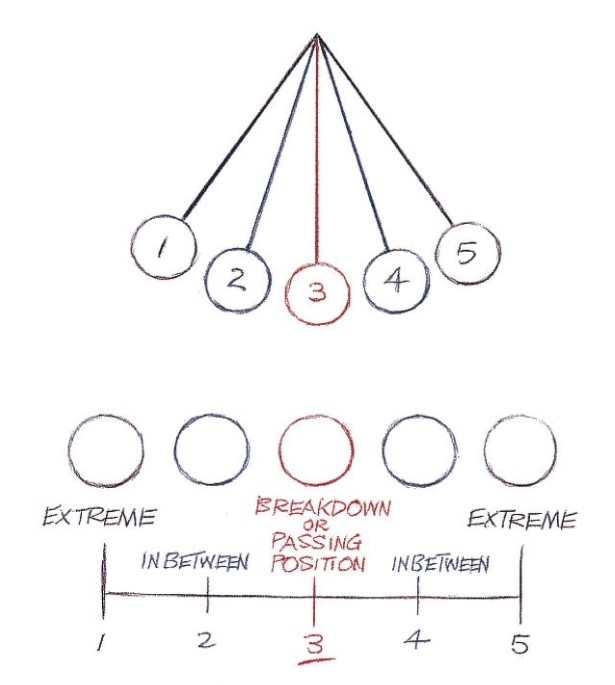

 

These two approaches aren't mutually exclusive -- there are methods for blending both straight ahead AND pose-to-pose in the same animation.

Here's one example from pages 63 - 68 of the Animator's Survival Kit:

<figure>
    
    <figcaption>Begin with Pose-to-pose to establish keyframes and timing of each step the character takes. This will become the reference guide for our straight ahead animation.</figcaption>
</figure>

<figure>
    
    <figcaption>...then, on top of these poses, animate each body part / action separately using the straight-ahead method to add secondary actions and fluidity to the motion.</figcaption>
</figure>

 

#### 5. Follow through and overlap

<blockquote>
"An object in motion stays in motion"
<figcaption>-- Isaac Newton (basically)</figcaption></blockquote>

<iframe width="560" height="315" src="https://www.youtube-nocookie.com/embed/3GTkhSDBzYo?si=AVF2sc4TnhOlmeVy" title="YouTube video player" frameborder="0" allow="accelerometer; autoplay; clipboard-write; encrypted-media; gyroscope; picture-in-picture; web-share" referrerpolicy="strict-origin-when-cross-origin" allowfullscreen></iframe>

 

When an action stops, the momentum of that action may propel other objects to continue moving.

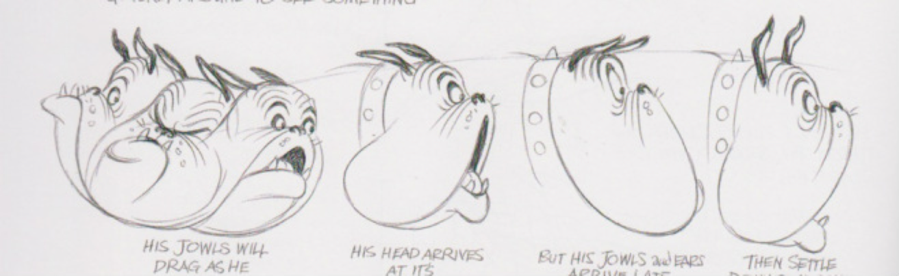

 

#### 6. Ease in and ease out

<blockquote>
"An object at rest will want to remain at rest, unless something causes them to move."
<figcaption>-- Isaac Newton (basically)</figcaption></blockquote>

In general, actions should **start slowly, speed up, and then slow down again before stopping**. This gives the illusion of physical weight to our animated body. 

This is achieved by placing drawings closer together at the start and end of an action.

Remember our pendulum example from [Pose-to-pose](#4-straight-ahead-vs-pose-to-pose)? 

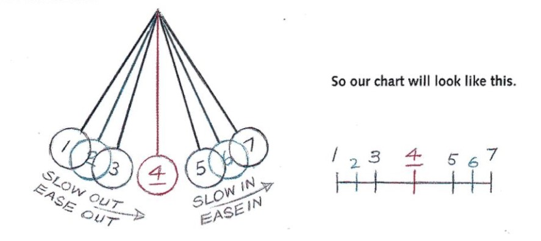

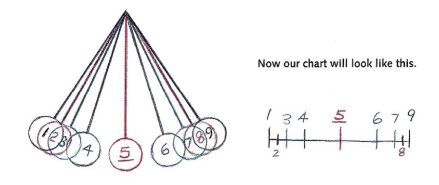

 

#### 7. Arcs

Arcs look natural. Try to arc as many lines of action as possible.

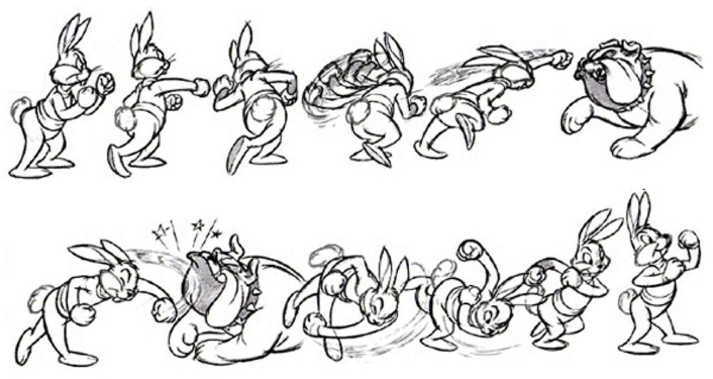

 

#### 8. Secondary Action

Movement that is dependent upon some other, active movement. Consider the hierarchy within the animated body -- which body part should follow what? 

<figure>

<figcaption>-- Keke, <a href="https://k-eke.tumblr.com/post/172999953576/happy-tap-dancing-fox">Happy tap dancing fox</a>.
</figcaption>
</figure>

 

#### 9. Timing

<blockquote>
"It's all in the timing and the spacing"
<figcaption>-- Grim Natwick</figcaption></blockquote>

How many drawings will you choose to make between important poses, and where will you place them? How much **space** is there between animation frames **on the canvas, and on the timeline**?

Consider your **frame rate**, and whether you're animating on ones or twos.

* more in-between frames = smoother action
* less positional spacing in between frames on canvas = moves slower
* shorter duration in between frames on timeline = faster animation

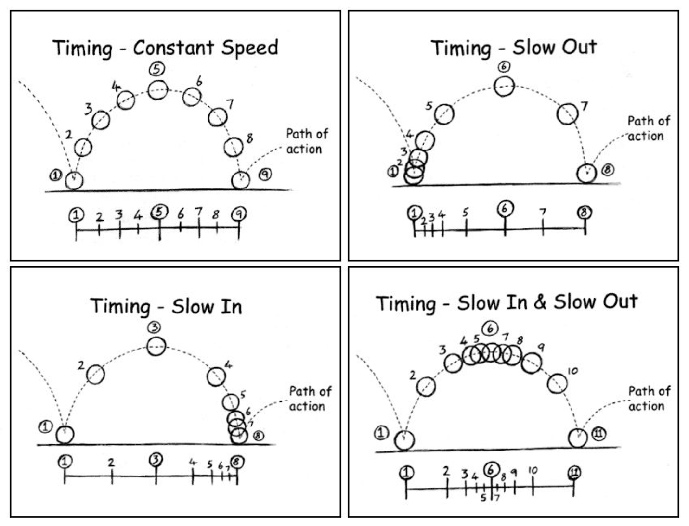

 

#### 10. Exaggeration

Pushing poses so they are as expressive as possible makes animation feel more alive.

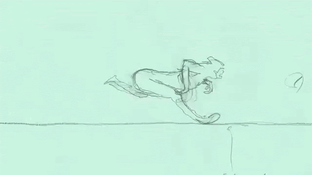

 

#### 11. Good (or "solid") drawing

A sense of **three-dimensionality**: form, volume, proportion, perspective. 

<figure>
<iframe title="vimeo-player" src="https://player.vimeo.com/video/36626926?h=c541297d32" width="500" height="360" frameborder="0" referrerpolicy="strict-origin-when-cross-origin" allow="autoplay; fullscreen; picture-in-picture; clipboard-write; encrypted-media; web-share"   allowfullscreen></iframe>
<figcaption>-- James Baxter, Spirit Roughs. Here's more of his pencil tests online: <a href="https://livlily.blogspot.com/2010/10/james-baxter.html">https://livlily.blogspot.com/2010/10/james-baxter.html</a></figcaption>
</figure>

 

**Character turnarounds**, for example, establish how a character should appear from different perspectives.

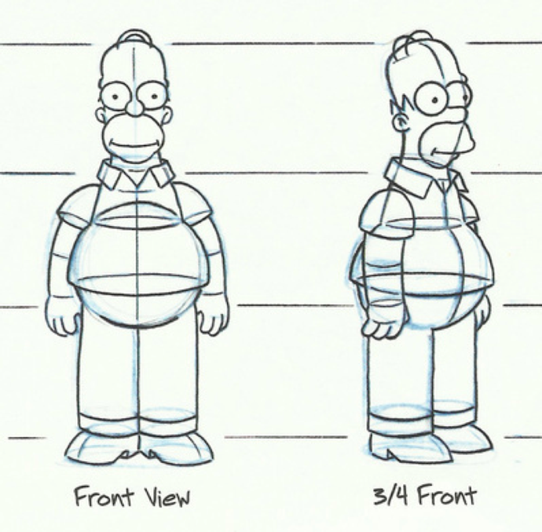

 

**Clarity of pose**: line of action, silhouette.

 

 

**Avoid perfect symmetry** or "twinning", which makes drawings look flat; try twisting the body, or using Contrapposto (counterpose in English). 

<figure>

<figcaption>-- An example from "The Illusion of Life".</figcaption>
</figure>

 

 

#### 12. Appeal

Appeal is subjective -- consider what makes a shape **memorable**. 

E.g. Interesting proportions, defined edges, simplified details, dynamic colors, etc.

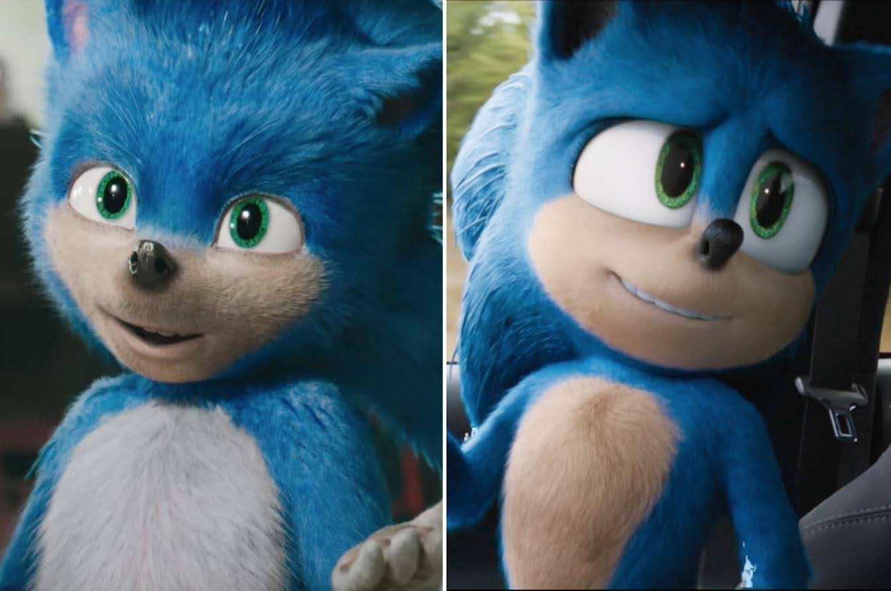

 

---

### Quick review

Can you identify which principle(s) have been included in these videos?

- [Video 1](./img/triggerworkshop.mp4)
- [Video 2](https://www.youtube.com/watch?v=seA5BVFJSnQ)
- [Video 3](https://www.youtube.com/watch?v=csvOWBDx1oM)
- [Video 4](https://www.youtube.com/watch?v=V1RM_eIlYKw)

---

### Common Terminology in 2D Animation 

#### Frame

One drawing in a sequence on a timeline.

E.g. This bouncing ball animation is made up of 30 frames. 

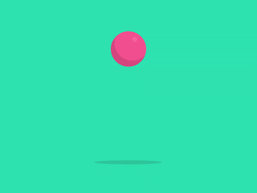 
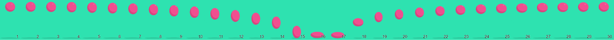

 

#### Frame Rate

Defined in **frames per second (fps)**.

- **Ones**: a drawing every frame;  (e.g. in 24 fps, we'd have 24 drawings a second.)
- **Twos**: a drawing ever two frames.  (e.g. in 24 fps, we'd have 12 drawings a second, so it's technically 12 fps.)

 

#### Layer

A system managed by animation software that allows you to combine effects or drawings non-destructively.

Animations can be separated by body part, colour fill (e.g. base, shadow, highlights), etc.

<figure>

<figcaption>-- Mob Psycho 100 II Opening Music Video.</figcaption>
</figure>

 

<figure>

<figcaption>-- Taken from the <a href="https://www.live2d.com/en/cubism/about/">Live2D Cubism Editor website.</a></figcaption>
</figure>

 

#### Onion Skinning

An effect managed by animation software that allows you to see the frame before or after the current frame you are working on. This allows you to place your drawings more accurately.

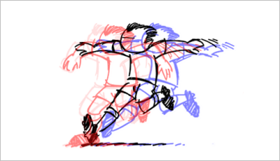

 

#### Keyframes

*("keys" for short)*

The main poses of your animation (or the "storytelling drawings" that show what's happening in the shot.)

In digital animation, these markers on a timeline indicate the beginning or end of an action.

 

#### In-between

*(verb = "tween")*

Frames that connect important poses (keyframes).

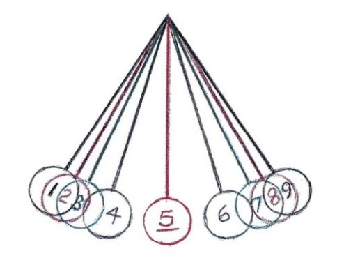

 

#### Interpolation

The approximation of unknown values between two known data points. 

In animation, the term "keyframe interpolation" is used to describe the distribution of in-between frames. 

Here's an example from [Eli Guerron](https://www.eliguerron.com/math-function-based-behaviors-for-ui-animations/):

<figure>
    
    <figcaption>-- Linear interpolation.</figcaption>
</figure>

<figure>
    
    <figcaption>-- Smoothstep interpolation.</figcaption>
</figure>

 

#### Smear

Frames that depict “blur” and use dramatic distortions or iteration to create the illusion of speed. 

Historically a budgetary necessity for limited animation to lower costs through fewer drawings, though some consider this a stylistic choice.

<figure>

<figcaption>-- Guy Buffet, Singapore Sling, among <a href="https://www.guybuffet.com/gallery/Limited-Edition-Prints/G0000gRfwWbFR9iw/">many other paintings of bartenders making drinks</a>.</figcaption>
</figure>

 

<figure>

<figcaption>-- Dry brush effect</figcaption>
</figure>

 

<figure>

<figcaption>-- Animation smears</figcaption>
</figure>

 

<figure>

<figcaption>-- Multiples</figcaption>
</figure>

 

<figure>

<figcaption>-- A combination of dry brush, smears, and multiples</figcaption>
</figure>

 

#### Morph

Visual effects technique which transforms one shape into another in a smooth transition.

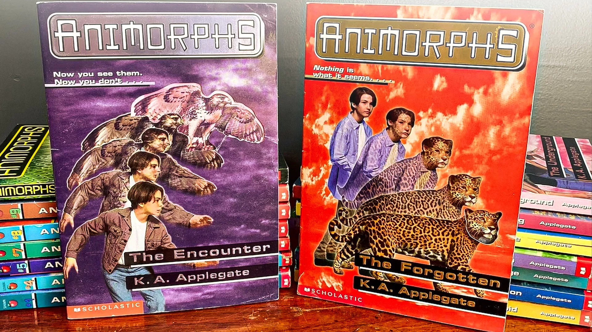

 

 

#### Boil

A stylistic decision to trace over lines or repeat textures repeatedly, to add motion to an otherwise still frame.

 

#### Loop

The first and last frame of an animation are sequential, allowing the animation to repeat seamlessly and endlessly.

<figure>

<figcaption>-- Anna Firth
</figcaption>
</figure>

 

<iframe title="vimeo-player" src="https://player.vimeo.com/video/296503067?h=75ae0f4feb" width="640" height="360" frameborder="0" referrerpolicy="strict-origin-when-cross-origin" allow="autoplay; fullscreen; picture-in-picture; clipboard-write; encrypted-media; web-share"   allowfullscreen></iframe>

 

Many animated films use loops to create repetitive movements (or add line boil animations to an otherwise still moment.)

Can you identify moments where animation loops have been used in these films? 

<iframe title="vimeo-player" src="https://player.vimeo.com/video/304241937?h=01d932e35e" width="640" height="360" frameborder="0" referrerpolicy="strict-origin-when-cross-origin" allow="autoplay; fullscreen; picture-in-picture; clipboard-write; encrypted-media; web-share"   allowfullscreen></iframe>

 

<iframe title="vimeo-player" src="https://player.vimeo.com/video/74627307?h=cbe69a44ac" width="640" height="360" frameborder="0" referrerpolicy="strict-origin-when-cross-origin" allow="autoplay; fullscreen; picture-in-picture; clipboard-write; encrypted-media; web-share"   allowfullscreen></iframe>

 

<iframe title="vimeo-player" src="https://player.vimeo.com/video/81986358?h=8b5ead0cb0" width="640" height="360" frameborder="0" referrerpolicy="strict-origin-when-cross-origin" allow="autoplay; fullscreen; picture-in-picture; clipboard-write; encrypted-media; web-share"   allowfullscreen></iframe>

 

So, how does looping animation work in games and interactive projects?

 

---

## How Interactive Animation Works

In interactive projects, animations are used as **assets** (ie. resource material) that can be programmed and manipulated through the development software. 

These animation assets are typically designed to be used as components for a type of computation model called **finite state machines**: 

- they have a **finite list of possible states**. 
- they can only be in **ONE state** at any given time. 
- they can **transition** from one state to another in response to some **inputs**. 

 

When we get into Unity, you'll arrange your animations into this finite state machine called the Animator component. 

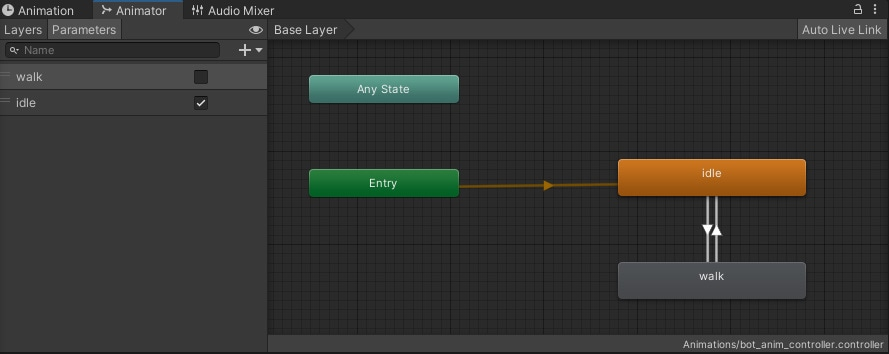

 

The animator can transition from one state to another either at the end of an animation, or using conditional parameters such as: 

- **Bools**: a value that can either be true (1) or false (0).
- **Triggers**: fires once, then automatically turns off immediately after. 

*More on these next week...*

 

Generally, we can organize animations for interactive projects into two different state categories -- **Idle states**, and **Active states**.

### Idle State

When an interactable asset is **at rest** or **not receiving any player input**, we call this an Idle animation, Idle state, or just "an idle." 

<iframe width="560" height="315" src="https://www.youtube-nocookie.com/embed/MB5Okiv7TpU?si=1WmqilT1T2YuEkrz" title="YouTube video player" frameborder="0" allow="accelerometer; autoplay; clipboard-write; encrypted-media; gyroscope; picture-in-picture; web-share" referrerpolicy="strict-origin-when-cross-origin" allowfullscreen></iframe>

 

Technically, an object that is "idling" doesn't need to animate at all -- but it can! 

It's common to see characters in video games idle, but really, *any* animation can loop, so *anything* can idle.

### Active State

An interactable asset that responds to a certain input is said to have transitioned from an "idle" to "active" state. 

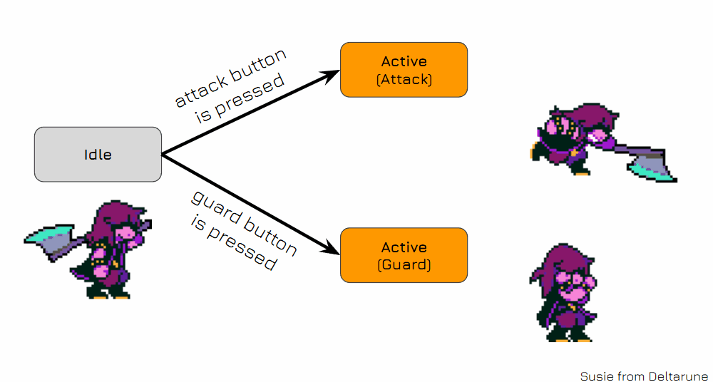

 

---