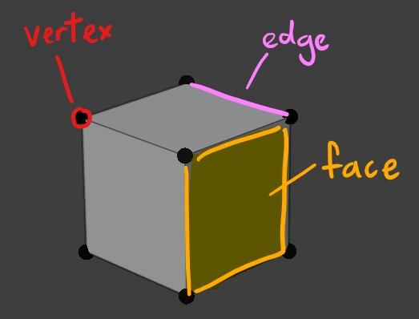

<!--jump to anchor tag adjusted to header height offset-->

# 3D Interactive Animation and CG Fundamentals

## Screening 

Some ideas and considerations for your project scope... 

---

**Camera perspective, staging... who is your player playing as?**

<iframe width="560" height="315" src="https://www.youtube-nocookie.com/embed/-yo8I1-kZ6U?si=KAnaXm0P2LFpf8a6" title="YouTube video player" frameborder="0" allow="accelerometer; autoplay; clipboard-write; encrypted-media; gyroscope; picture-in-picture; web-share" referrerpolicy="strict-origin-when-cross-origin" allowfullscreen></iframe>

 

<figure>

<figcaption>--Arcane Kids, <a href="https://www.youtube.com/watch?v=bp5dRdhpkSI">"Room of 1000 Snakes"</a></figcaption>
</figure>

 

**CG object as digital toy**

<iframe width="560" height="315" src="https://www.youtube-nocookie.com/embed/N6dxrPLl9dQ?si=kEOXbZqnYl-RNCyO" title="YouTube video player" frameborder="0" allow="accelerometer; autoplay; clipboard-write; encrypted-media; gyroscope; picture-in-picture; web-share" referrerpolicy="strict-origin-when-cross-origin" allowfullscreen></iframe>

 

**... or digital creature!** 

<iframe width="560" height="315" src="https://www.youtube-nocookie.com/embed/JBgG_VSP7f8?si=COMxGhyuXF_MkCUJ" title="YouTube video player" frameborder="0" allow="accelerometer; autoplay; clipboard-write; encrypted-media; gyroscope; picture-in-picture; web-share" referrerpolicy="strict-origin-when-cross-origin" allowfullscreen></iframe>

<iframe width="560" height="315" src="https://www.youtube-nocookie.com/embed/PdGAG5_VKZA?si=GYcy_OHidMNtqMeG" title="YouTube video player" frameborder="0" allow="accelerometer; autoplay; clipboard-write; encrypted-media; gyroscope; picture-in-picture; web-share" referrerpolicy="strict-origin-when-cross-origin" allowfullscreen></iframe>

 

**Optional custom controller**

*more examples to come!*

<iframe width="560" height="315" src="https://www.youtube-nocookie.com/embed/rfQqh7iCcOU?si=WtcmCWYvmv_JexMX" title="YouTube video player" frameborder="0" allow="accelerometer; autoplay; clipboard-write; encrypted-media; gyroscope; picture-in-picture; web-share" referrerpolicy="strict-origin-when-cross-origin" allowfullscreen></iframe>

 

**Some student projects for inspiration**

<figure>

<iframe src="https://player.vimeo.com/video/710530770?badge=0&amp;autopause=0&amp;player_id=0&amp;app_id=58479" frameborder="0" allow="autoplay; fullscreen; picture-in-picture; clipboard-write; encrypted-media; web-share" referrerpolicy="strict-origin-when-cross-origin" style="position:absolute;top:0;left:0;width:100%;height:100%;" title="Press W to Move Forward by Michael Luo"></iframe>

<figcaption>--Michael Luo, <a href="https://games.ucla.edu/game/press-w-to-move-forward">"Press W to Move Forward"</a>. </figcaption>
</figure>

> A 5-minute experimental horror game exploring the rhetorics of progress, control, and societal pressure. Like the title suggests, the player's only mode of control is through pressing W to progress the game with occasional mouse movements.

 

<figure>

<iframe src="https://player.vimeo.com/video/551544463?h=70e3f4b6ff&amp;badge=0&amp;autopause=0&amp;player_id=0&amp;app_id=58479" frameborder="0" allow="autoplay; fullscreen; picture-in-picture; clipboard-write; encrypted-media; web-share" referrerpolicy="strict-origin-when-cross-origin" style="position:absolute;top:0;left:0;width:100%;height:100%;" title="Groom - Miles Peyton"></iframe>

<figcaption>--Miles Peyton, <a href="https://games.ucla.edu/game/groom">"Groom"</a></figcaption>
</figure>

> A game installation that centers on an insect with wings who cannot fly.

 

<figure>

<iframe src="https://player.vimeo.com/video/625661245?badge=0&amp;autopause=0&amp;player_id=0&amp;app_id=58479" frameborder="0" allow="autoplay; fullscreen; picture-in-picture; clipboard-write; encrypted-media; web-share" referrerpolicy="strict-origin-when-cross-origin" style="position:absolute;top:0;left:0;width:100%;height:100%;" title="Elsie Wang Interview"></iframe>

<figcaption>--Elsie Wang, <a href="https://games.ucla.edu/game/intimacy">"Intimacy"</a></figcaption>
</figure>

> A two-player game that expresses an intimate human relationship. While the goal of the game is ambiguous, each player uses a single button on a custom controller to make the characters collide with one another.

 

---

 

## CG Fundamental Concepts

### What is a 3D object?

In computer graphics, a 3D object is a **polygonal mesh**, made up of single polygons connected between each other.

<figure>

    

    

<figcaption>-- Images taken from Jacob Gaboury's book "Image Objects"</figcaption>
</figure>

 

A polygonal mesh is made up of 3 components: 

- **Vertexes**:  a point in 3D space
- **Edges**:  a line between 2 vertexes, connecting 2 faces.
- **Faces** (aka Polygons, aka Planes):  a surface created between edges.

 

Polygons are also referred to as **N-gons**, i.e. a polygon defined by *N* number of sides (where N is a whole number.)

An N-gon with 3 sides is called a **triangle**; an N-gon with 4 sides is called a **quad**. 

 

### Topology

Topology refers to **the arrangement of vertices and edges** to create the mesh surface. 

Good topology concerns the **flow** of your mesh. Good mesh flow will give better results in mesh deformation, shading, and seams for UV unwrapping. 

If you're using an auto-rigging software like Mixamo, bad topology will cause a lot of problems...

Below are some principles for good topology:

#### Edge Loops

An "edge loop" refers to a ring of connected edges. A clean edge loop is made up of **Quads**, not Triangles or any other N-gon.

"Face loops" are formed between pairs of adjacent edge loops.

Benefits of edge loops include:

- **Quick Selection** Most modelling software programs offer the option for edge-loop selections to speed up modelling. This also makes adjusting your polygon density across your mesh a lot easier by simply adding / reducing edge loops.
- **Better deformation** Especially important in areas of the mesh that will bend/compress/stretch the most, e.g. limb joints like armpits, knees, elbows, crotch/hips/butt, mouth corners/cheeks. Usually good to have denser edge-loops in these areas. 

<figure>

<figcaption>--Image taken from "Blender 3D by Example".</figcaption>
</figure>

 

#### Polygon Density

In areas where there's curvature or more detail required, add more polygons.

In rigid, straight areas, have less polygons. 

**Try to avoid any sudden, extreme changes in polygon density across your mesh** -- the results will become apparent if you choose to apply smooth-shading on your object. Gradate any shifts in polygon density as much as possible to maintain an evenly distributed topology.

 

### Polycount

Polycount (short for "polygon count") refers to the **total number of faces** in your mesh... which is also determined by your vertex count. 

There is a difference in the way modelling software and game engines calculate polycount--

Unlike modelling software, **game engines render all meshes into triangles**. Therefore, in games, a mesh's polycount refers to the **total number of triangles** in a mesh. 
<figure><figcaption>-- Polycount comparison between a modelling software (left) and a game engine (right). Image by Michael "cyrid" Taylor.</figcaption></figure>

 

#### High-poly Meshes

Pros:

- Good for sculpting and vertex painting.
- Better for cloth simulation.

Cons: 

- Longer to render due to light/shadow calculations and bulkier vertex information. This is prone to causing lag in game engines like Unity. 

 

Examples:

<figure>

<figcaption>-- Anna Tébo, <a href="https://www.instagram.com/p/ClyvESQMTmD/?img_index=1">Basiland.</a></figcaption>
</figure>

 

<figure>
<iframe title="vimeo-player" src="https://player.vimeo.com/video/28501846?h=a1acb65b48" width="640" height="360" frameborder="0" referrerpolicy="strict-origin-when-cross-origin" allow="autoplay; fullscreen; picture-in-picture; clipboard-write; encrypted-media; web-share"   allowfullscreen></iframe>
<figcaption>-- David Lewandowski, going to the store
</figure>

 

#### Low-poly Meshes

Pros: 

- Shorter render times, perfect for game engines like Unity.
- Uses less disk space.
- Constraints of low-poly design can create opportunities for distinct stylisation.
- Illusion of detail and smoothness can be created through textures (e.g. smooth shade, normal maps).

Cons: 

- Bad for sculpting and vertex painting.

 

Examples: 

<figure>

<figcaption>-- Gage Lindsten, <a href="https://www.instagram.com/p/Cn0apxMgCi4/?hl=en">The Wizards of Hy Do Zel pray to the last Spirit Cocoon.</a></figcaption>
</figure>

 

<figure>

<figcaption>-- Victor Estrella, <a href="https://www.instagram.com/p/DKTUD5DAj-z/">If Mexico City had a starter menu.</a></figcaption>
</figure>

 

<iframe width="560" height="315" src="https://www.youtube-nocookie.com/embed/deAN_pdfrbw?si=SdcyK5z9EyVMB_t_" title="YouTube video player" frameborder="0" allow="accelerometer; autoplay; clipboard-write; encrypted-media; gyroscope; picture-in-picture; web-share" referrerpolicy="strict-origin-when-cross-origin" allowfullscreen></iframe>

 

### Normals

Normals are directional vectors with a length of 1. In 3D computer graphics, they determine how our mesh is rendered under different camera perspectives and lighting directions.

#### Face Normals

Every face has a normal that is perpendicular to its surface. They indicate **which side of the face our "outward" surface is pointing towards**. 

If any polygons on your mesh seem to have their textures rendered inside-out, it's likely the result of **back-face culling** (a rendering technique that does not draw any polygons facing away from the viewer.) This means that their normals are pointing inwards, and thus need to be corrected by flipping them the other way around. 

<figure>

    

    

<figcaption>-- Inverted normals (left) become apparent when smooth-shading is turned on (right).</figcaption>
</figure>

 

#### Vertex Normals

**Each vertex per polygon** has a normal that determines how our surface receives light. 

For example, below is a mesh made up of two quads consisting six vertices, but there are eight vertex normals in total.

> *1 normal per vertex \* 4 vertices per quad \* 2 quads = ****8 vertex normals in total***

 

How our mesh surface is lit depends on **the angle between the light vector and our vertex normal**. The closer this angle approaches zero, the more light our vertex receives.

<figure>

<figcaption>-- Image based on original diagram from FrostSoft.</figcaption>
</figure>

 

In **flat shading**, vector normals face the same direction as their polygon's normal to give "hard" edges.

In **smooth shading**, vector normals are calculated using the average of polygon normals that share this vertex. This creates the appearance of "soft" edges, even when working on low-poly models. 

<figure>

<figcaption>-- Image from FrostSoft.</figcaption>
</figure>

 

### UVs

When we UV unwrap our mesh, we are obtaining a 2D layout of our mesh's geometry called a **UV map**.

This UV map tells us which how a 2D image (such as a base texture or normal map) should be mapped onto our mesh's surface. 

**U and V refer to the X (width) and Y (height) coordinates of a 2D image.** Because X and Y are already being used to represent 3D spatial coordinates, we use U and V for mapping 2D coordinates of texture images.

<figure>

<figcaption>-- From 3D mesh (left) to UV map (top center) to texture image (right) to final textured mesh (bottom).</figcaption>
</figure>

 

### Normal Maps

A normal map is **an image that stores a direction at every pixel**. The **red, green, and blue channels** are used to control the direction of each pixel's normal. 

Normal maps are used to **create the illusion of high-resolution details on low-resolution models**. 

You can download normal maps online for repeating textures, paint your own on Substance Painter, or bake normal maps from high-poly meshes onto lower-poly meshes in 3D software. 

<figure>

<figcaption>-- A normal mapped model, the mesh without the map, and the normal map alone. Image by <a href="https://ericchadwick.com/">Eric Chadwick</a>.</figcaption>
</figure>

 

<figure>

<figcaption>-- You can add normal maps to materials in Unity.</figcaption>
</figure>

 

### File Formats

#### FBX

☑️ Rig data  
☑️ Animation Timelines  
☑️ Vertex data  
☑️ Textures, UV maps, *some* material data 

 

#### OBJ

☑️ Vertex data  
☑️ UV maps, *some* material data  
☑️ Export includes an .MTL file, which .OBJ references for its material / texture data.  

*No animation data supported.*

 

#### BLEND

Unity Editor also supports .blend file imports. This format is useful for setting up static environment models in your scene, allowing you to continuously add to your Blender file without having to re-export it every time there's new changes. 

However, this import process has been notoriously buggy, and can be unpredictable depending on your version of Blender and Unity... but it's worth a try!