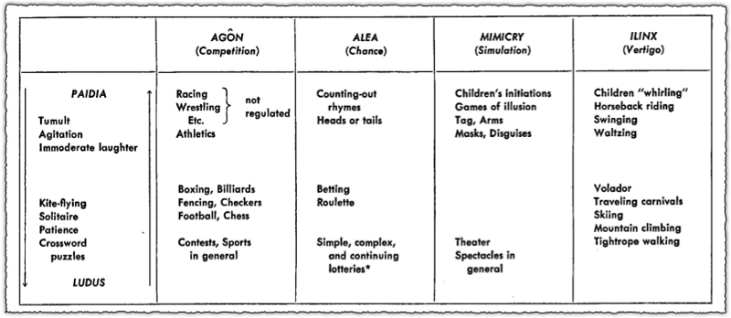

<!--jump to anchor tag adjusted to header height offset-->

# Reading / Media Response

## Reading / Media 1

📌 <b>DUE:</b> Week 2 Tuesday, October 7

<a href="https://docs.google.com/forms/d/e/1FAIpQLSf-aQnjMvUGLt_pN5MVnybPk62gFD3cdg7uOem0RNcTDoZitw/viewform?usp=sharing&ouid=111038396537777799192">Submit Final Submission Here</a>

Reading / Media 1 comes in TWO parts: 

1. a reading response; and
2. a media response.

### READING RESPONSE

Read **at least one** of these short essays about ideation/building ideas by these animators published in **Mostly Moving**, an independent animation journal:

- Caleb Wood: [Looking at Shit: Conception of Ideas](https://mostlymoving.com/caleb-wood-essay)
- Jamie Wolfe: [Livin' in the Chaos Loop](https://mostlymoving.com/jamie-wolfe-essay)

Working with games and interactivity means thinking a lot about agency—what kind of agency will you give or deny your audience? Above, animators Jamie and Caleb talk about forces of **chaos** and **control** in relation to their practices. Take inspiration from Jamie and/or Caleb to formulate **at least three statements (number them!)** that explore how you feel about chaos and control in relation to your interactive practice.

### MEDIA RESPONSE

Spend at least **30 minutes** with **any TWO (2)** of the following projects: [**LINK TO READING/MEDIA 1 LIST**](https://docs.google.com/spreadsheets/d/1bxmhYjV7zo1lLmPvBTt7lpUcrBbYTv12-mCrTIunIm8/edit?usp=sharing)

In what ways do the above interactive projects create meaning when they grant or deny you agency? 

Take notes about your experience and reflections, then submit a write-up of your final response.

 

## Reading / Media 2

📌 <b>DUE:</b> Week 3 Tuesday, October 14

<a href="https://forms.gle/ggRQArWSf9tfguXA7">Submit Final Submission Here</a>

Read the following chapters from Gordon Calleja’s book, *In-Game: from Immersion to Incorporation*.

* [Chapter 3: The Player Involvement Model](https://drive.google.com/file/d/1tFpxk2-TuuSIrzvZ_x9JO14b7XKJRjmT/view?usp=sharing)
* [Chapter 4: Kinesthetic Involvement](https://drive.google.com/file/d/1VftK48U0J5J1yATRoWqT9YKvTHKTQJzg/view?usp=sharing)

 

Then play [*Way To Go*](http://a-way-to-go.com/). 

*(If it's not available to you, check out the sample video and making-of [here](https://www.unit9.com/project/way-to-go/).)*

 

For your response, prepare only a few sentences to answer each question below. **I will call on people in the class at random to share their thoughts.**

* According to Calleja, in what ways can game-players become involved with, or embody their avatars?
* What is a Magic Circle? Have you ever experienced this phenomenon?
* In what ways does Calleja think bodily involvement, or movement, augments gameplay?
* Which of Calleja’s ideas apply best to your experience of Way To Go?

 

## Reading / Media 3

📌 <b>DUE:</b> Week 6 Tuesday, November 4

<a href="https://forms.gle/2RAUbD6WEdMhu1iH6">Submit Final Submission Here</a>

As inspiration, spend some time with any one of the following resources (Manovich, or a project listed in the spreadsheet.) **I will call on people in the class at random to share their thoughts.**

### Option 1: Manovich Reading

Read ["On Totalitarian Interactivity"](https://drive.google.com/file/d/1VbKI7YMOtKc9MKs-FQ4s-dBmYD8v4Zlj/view?usp=drive_link) by Lev Manovich, then answer the following questions:

* According to Lev Manovich, what is the motivation for interactivity in "new" media? 
* Consider your own political, social, cultural ideology—are you able to pinpoint ways in which they have influenced your attitude toward, or perspective of, interactive media? …Computers in general?

*OR*

### Option 2: Play a project

Play any **ONE** project in this [spreadsheet](https://docs.google.com/spreadsheets/d/1SBo_X-aN6fOwxVZVowLKWvJ5_ByisbAx9lGoQ_yMBDU/edit?usp=sharing), then answer the following questions:

#### *Question 1.*

Roger Caillois introduces in his book "Man, Games, and Play" the fundamental categories of play--agon (competition games); alea (chance games); mimicry (simulation or role-play); and ilinx (vertigo or sense-altering experiences)

Can you fit the project you've played above into one or more of these categories? Or would you create your own category to describe this project--and if so, how would you describe this category?

#### *Question 2.*

Analyse your experience of embodiment (or disembodiment) in your selected project -- What role did you play in this reality, and how did that shape your interpretation of this project's intention? 

Justify your claim with at least 2 points of formal analysis (e.g. controls for interaction, perspective, aesthetics, timing, etc.) 