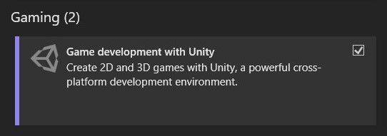
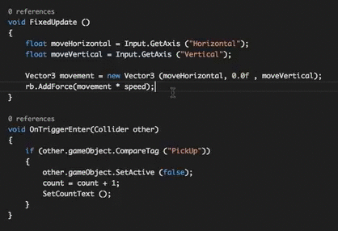

<!--jump to anchor tag adjusted to header height offset-->

# Tech Setup

## Setting up Unity and Visual Studio / Code

1. Create a [Unity ID](https://login.unity.com/en/sign-up) if you don't already have one, and download **Unity Hub**: [https://unity.com/download](https://unity.com/download)  

2. Open Unity Hub, and download **any version of Unity Editor (2021~2023) with long term support (LTS)** 

<b>⚠️ DO NOT USE UNITY 6!</b>

3. When downloading the Unity Editor, make sure to include the following modules (in check boxes)

    * ✅ **Microsoft Visual Studio Community**   
        (\*only available on WINDOWS)

        * If prompted to run the Visual Studio Installer, make sure that “Game Development with Unity” is checked under the Workloads tab.

        

        * **If you’re using a Mac device:**  
        Because Visual Studio for Mac is no longer supported, you’ll need to download [Visual Studio Code](https://code.visualstudio.com/) instead.

        Next, install the Unity for Visual Studio Code extension (published by Microsoft) from the [Visual Studio Code Marketplace](https://marketplace.visualstudio.com/items?itemName=visualstudiotoolsforunity.vstuc), or the [Extensions Marketplace](https://code.visualstudio.com/docs/configure/extensions/extension-marketplace) inside Visual Studio Code.

    * ✅ **Windows Build Support (IL2CPP or Mono)**

    * ✅ **Mac Build Support (IL2CPP or Mono)**

4. In Unity Hub, **activate a free personal Unity license.**

    

5. **Make a New Unity Project.**

    In Unity Hub, go to Projects \> New Project \> Select your editor version at the dropdown field above \> Select Universal 2D (To start, we will use the Universal Render Pipeline and create a 2D Unity Project.) 

    All Unity projects are stored locally as a folder on your computer. Select a name (e.g. “InteractiveAnimationProject1”) and location for your project folder.

    We’ll leave “Connect to Unity Cloud” and “Use Unity Version Control” unchecked for now. 

    Then click “Create Project.” 

6. **Set up Unity for Visual Studio / Code integration**

    Open up your newly created Unity project. In the Unity Editor, go to Windows \> Package Manager \> Make sure that Visual Studio Editor package (version 2.0.20 and above) has been installed on your project. 

    Then, go to Edit \> Preferences \> External Tools \> Select your External Script Editor as either “Visual Studio” or “Visual Studio Code”. This will be the default program that runs when you try to open up a script in Unity. 

### Intellisense for Unity C&#35;

Intellisense is a useful **auto-complete feature** that will give a dropdown list of suggestions for your code as you're typing. 

I recommend getting this working on your scripting program, because it will make the process of understanding C# a lot more assisted and easier to navigate. It is also helpful for referencing variables and functions across multiple scripts in your projects.

If you're not getting any dropdown options when writing your code, try troubleshooting your Intellisense feature -- here's some resources you may start from: 

- **For Visual Studio Code:**   [Stack Overflow: How to get intellisense in Visual Studio Code for Unity functions names?](https://stackoverflow.com/questions/52189426/how-to-get-intellisense-in-visual-studio-code-for-unity-functions-names)
- **For Visual Studio:**   [Fixing Visual Studio’s IntelliSense (auto-complete) in Unity](https://blog.terresquall.com/2020/11/fixing-visual-studios-intellisense-autocomplete-in-unity/)

---

## Setting up Blender

On your own laptop or desktop, install the same version of Blender that's on the classroom computers. 

More instructions soon... (once we enter the world of CG!)

<!--
- lazyviewport plugin (bc this is how i use blender)
- setup 3-button mouse shortcuts in preferences
- toggle extra objects? not sure if this is different in blender4
-->